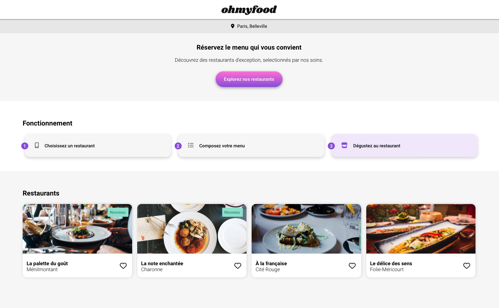
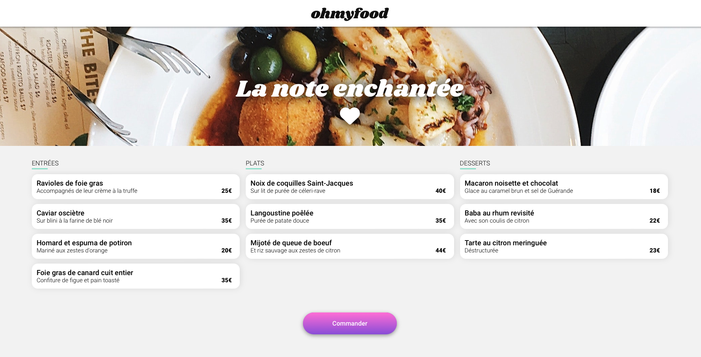

# 

Ohmyfood est une entreprise de commande de repas en ligne. Notre concept permet aux utilisateurs de composer leur propre menu et réduire leur temps d’attente dans les restaurants car leur menu est préparé à l’avance. Plus de perte de temps à consulter la carte !

[Lien vers Ohmyfood](http://octavegraf.github.io/ohmyfood)

## Captures d'écrans

## Auto correction

#### Le code est en bazar
Ma toute première expérience avec Sass m'a fait comprendre à quel point ce langage est utile. Même si après coup je trouve que j'aurais pu utiliser plus de fonctionnalités (comme l'utilisation de plusieurs fichiers sass pour l'ensemble du site plutôt qu'un par page). N'ayant également pas codé depuis un moment, le code est parfois un peu hasardeux et risquerait d'être difficile à maintenir pour un vrai projet. Le CSS généré quant à lui est plutôt bien ordonné.

#### Le cœur
Après y avoir passé une journée à y mettre toute mon énergie, en vain, j'ai opté pour utiliser une îcone _FontAwesome_ sous forme de texte. J'ai ensuité masqué ce texte et y ai intégré un _background-image dégradé_ en deux parties. L'une totalement blanche, l'autre contenant le dégradé qui s'affiche en _:hover_. Une simple _transition_ fait bouger le _background-image_ et permet d'obtenir l'effet de remplissage, comme demandé dans le brief.

#### Le reste des animations
J'ai trouvé l'utilisation des _keyframes_ et des transitions relativement facile. Le principe des _keyframes_ est exactement le même que le fonctionnement de la timeline d'_After Effects_, tandis que les _transitions_ ressemble trait pour trait au fonctionnement des transitions intelligentes de _Figma_.
